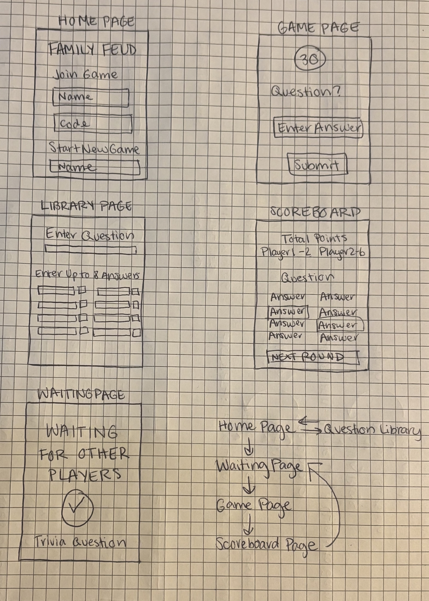
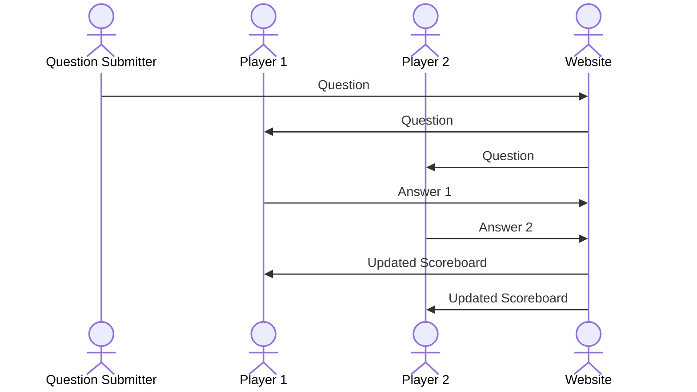

# Family Feud

[My Notes](notes.md)

This application is a Family Feud inspired game. For the purposes of learning web programming for CS 260, it will only reflect the "Fast Money" round.

## 🚀 Specification Deliverable

For this deliverable I did the following. I checked the box `[x]` and added a description for things I completed.

- [x] Proper use of Markdown - I used Markdown correctly and made a special effort to look for ways to practice using different features in my notes.
- [x] A concise and compelling elevator pitch - I added an elevator pitch tailored towards homesick college students.
- [x] Description of key features - I added a detailed list of the most notable features of the application.
- [x] Description of how you will use each technology - I named at least one way I will be implementing each technology.
- [x] One or more rough sketches of your application. Images must be embedded in this file using Markdown image references. - I added an image that includes sketches of all html pages and a basic map of how the application will run.

### Elevator pitch

Moving away from home has its highs and lows. I definitely don't miss curfew but sometimes I crave a good old family game night. Luckily, family game night doesn't have to be as many miles away from home as you are. The Family Feud application allows you to play a classic family game with anyone, no matter the distance. Up to two devices can join and compete to see who knows the most, just like in the classic Family Feud game show. It's an automatic homesickness cure. 

### Design

This sequence diagram shows how the players interact with the backend to enter questions and answers.

### Key features

- Secure login over HTTPS that allows access to specific family's game
- Ability to enter question, answers, and points for future games
- Ability to answer question in 30 seconds during game
- Scoreboard that updates as answers are submitted
- Waiting page with trivia questions to prep the mind for the game

### Technologies

I am going to use the required technologies in the following ways.

- **HTML** - five HTML pages: home login page, waiting page, enter question page, answer question page, scoreboard page
- **CSS** - consistent styling across pages, styling adjusts to screen size
- **React** - login, enter questions, enter answers, displaying and updating scoreboard
- **Service** - backend service with endpoints for:
  * login
  * retrieving question
  * retrieving and displaying answers
  * third-party trivia on waiting page
- **DB/Login** - stores question, answers, and points entered by players in library
- **WebSocket** - scoreboard automatically updates as players enter answers

## 🚀 AWS deliverable

For this deliverable I did the following. I checked the box `[x]` and added a description for things I completed.

- [x] **Server deployed and accessible with custom domain name** - [My server link](https://familynight.click).

## 🚀 HTML deliverable

For this deliverable I did the following. I checked the box `[x]` and added a description for things I completed.

- [x] **Prerequisites** - I completed all prerequisites (deploying Simon HTML, GitHub linked on home page, notes in this document, more than 10 commits)
- [x] **HTML pages** - I made five HTML pages, one for each component of my application.
- [x] **Proper HTML element usage** - I used the BODY, NAV, MAIN, HEADER, and FOOTER HTML tags, as well as others.
- [x] **Links** - I added links for the Home page and the Question Submission pages. The other pages will not have direct links and will instead be accessed throughout the game.
- [x] **Text** - I added all necessary textual content.
- [x] **3rd party API placeholder** - I added a placeholder on the waiting page for a trivia API 3rd party service call.
- [x] **Images** - I added a picture of a clock on the waiting page.
- [x] **Login placeholder** - I added a login placeholder on the home page, as well as a user name display on all game pages.
- [x] **DB data placeholder** - I added database placeholders to show where questions, answers, and scores will be added after being pulled from the library. The library page represents where users will add to the database.
- [x] **WebSocket placeholder** - I added a Websocket data placeholder on the scoreboard page where users' scores will be updated in realtime.

## 🚀 CSS deliverable

For this deliverable I did the following. I checked the box `[x]` and added a description for things I completed.

- [ ] **Visually appealing colors and layout. No overflowing elements.** - I did not complete this part of the deliverable.
- [ ] **Use of a CSS framework** - I did not complete this part of the deliverable.
- [ ] **All visual elements styled using CSS** - I did not complete this part of the deliverable.
- [ ] **Responsive to window resizing using flexbox and/or grid display** - I did not complete this part of the deliverable.
- [ ] **Use of a imported font** - I did not complete this part of the deliverable.
- [ ] **Use of different types of selectors including element, class, ID, and pseudo selectors** - I did not complete this part of the deliverable.

## 🚀 React part 1: Routing deliverable

For this deliverable I did the following. I checked the box `[x]` and added a description for things I completed.

- [ ] **Bundled using Vite** - I did not complete this part of the deliverable.
- [ ] **Components** - I did not complete this part of the deliverable.
- [ ] **Router** - I did not complete this part of the deliverable.

## 🚀 React part 2: Reactivity deliverable

For this deliverable I did the following. I checked the box `[x]` and added a description for things I completed.

- [ ] **All functionality implemented or mocked out** - I did not complete this part of the deliverable.
- [ ] **Hooks** - I did not complete this part of the deliverable.

## 🚀 Service deliverable

For this deliverable I did the following. I checked the box `[x]` and added a description for things I completed.

- [ ] **Node.js/Express HTTP service** - I did not complete this part of the deliverable.
- [ ] **Static middleware for frontend** - I did not complete this part of the deliverable.
- [ ] **Calls to third party endpoints** - I did not complete this part of the deliverable.
- [ ] **Backend service endpoints** - I did not complete this part of the deliverable.
- [ ] **Frontend calls service endpoints** - I did not complete this part of the deliverable.
- [ ] **Supports registration, login, logout, and restricted endpoint** - I did not complete this part of the deliverable.

## 🚀 DB deliverable

For this deliverable I did the following. I checked the box `[x]` and added a description for things I completed.

- [ ] **Stores data in MongoDB** - I did not complete this part of the deliverable.
- [ ] **Stores credentials in MongoDB** - I did not complete this part of the deliverable.

## 🚀 WebSocket deliverable

For this deliverable I did the following. I checked the box `[x]` and added a description for things I completed.

- [ ] **Backend listens for WebSocket connection** - I did not complete this part of the deliverable.
- [ ] **Frontend makes WebSocket connection** - I did not complete this part of the deliverable.
- [ ] **Data sent over WebSocket connection** - I did not complete this part of the deliverable.
- [ ] **WebSocket data displayed** - I did not complete this part of the deliverable.
- [ ] **Application is fully functional** - I did not complete this part of the deliverable.
