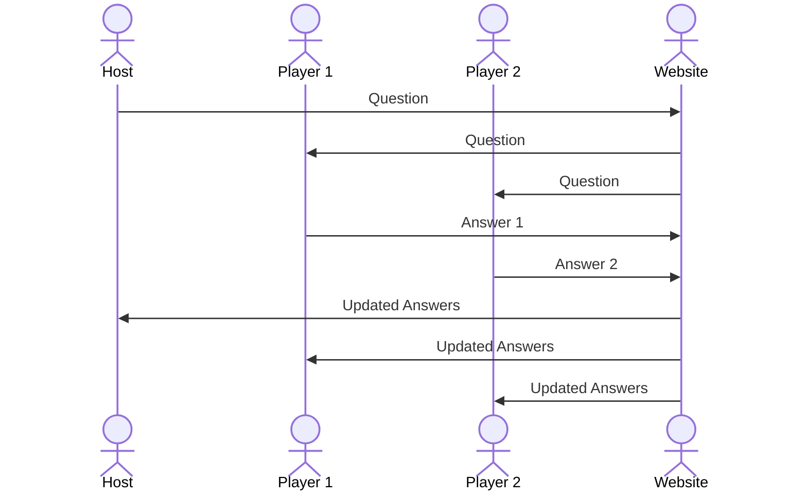

# Family Feud

[My Notes](notes.md)

This application is a Family Feud inspired game. For the purposes of learning web programming for CS 260, it will only reflect the "Fast Money" round.

## 🚀 Specification Deliverable

For this deliverable I did the following. I checked the box `[x]` and added a description for things I completed.

- [x] Proper use of Markdown - I used Markdown correctly and made a special effort to look for ways to practice using different features in my notes.
- [x] A concise and compelling elevator pitch - I added an elevator pitch tailored towards homesick college students.
- [x] Description of key features - I added a detailed list of the most notable features of the application.
- [x] Description of how you will use each technology - I named at least one way I will be implementing each technology.
- [ ] One or more rough sketches of your application. Images must be embedded in this file using Markdown image references.

### Elevator pitch

Moving away from home has its highs and lows. I definitely don't miss curfew but sometimes I crave a good old family game night. Luckily, family game night doesn't have to be as many miles away from home as you are. The Family Feud application allows you to play a classic family game with anyone, no matter the distance. One person, the "host", starts the game and enters in questions so every family can play a game tailored to what they know and love. Other people can join and compete to see who knows the most, just like in the classic Family Feud game show. It's an automatic homesickness cure. 

### Design

This sequence diagram shows how the host and players interact with the backend to enter questions (for the host) and answers (for the players).

### Key features

- Secure login over HTTPS that allows access to specific host's game
- Ability to enter question, answers, and points for host
- Ability to answer question in 30 seconds for players
- Option to play again without starting new game
- Scoreboard that updates as answers are submitted
- Question, answers, and points are saved and can be selected from library

### Technologies

I am going to use the required technologies in the following ways.

- **HTML** - six HTML pages: home login page, waiting page, enter question page, view question library page, answer question page, scoreboard page
- **CSS** - consistent styling across pages, styling adjusts to screen size
- **React** - login, enter questions, enter answers, displaying and updating scoreboard
- **Service** - backend service with endpoints for:
  * login
  * retrieving question
  * retrieving and displaying answers
  * third-party image on waiting page
- **DB/Login** - stores question, answers, and points entered by host in library
- **WebSocket** - scoreboard automatically updates as players enter answers

## 🚀 AWS deliverable

For this deliverable I did the following. I checked the box `[x]` and added a description for things I completed.

- [ ] **Server deployed and accessible with custom domain name** - [My server link](https://yourdomainnamehere.click).

## 🚀 HTML deliverable

For this deliverable I did the following. I checked the box `[x]` and added a description for things I completed.

- [ ] **HTML pages** - I did not complete this part of the deliverable.
- [ ] **Proper HTML element usage** - I did not complete this part of the deliverable.
- [ ] **Links** - I did not complete this part of the deliverable.
- [ ] **Text** - I did not complete this part of the deliverable.
- [ ] **3rd party API placeholder** - I did not complete this part of the deliverable.
- [ ] **Images** - I did not complete this part of the deliverable.
- [ ] **Login placeholder** - I did not complete this part of the deliverable.
- [ ] **DB data placeholder** - I did not complete this part of the deliverable.
- [ ] **WebSocket placeholder** - I did not complete this part of the deliverable.

## 🚀 CSS deliverable

For this deliverable I did the following. I checked the box `[x]` and added a description for things I completed.

- [ ] **Visually appealing colors and layout. No overflowing elements.** - I did not complete this part of the deliverable.
- [ ] **Use of a CSS framework** - I did not complete this part of the deliverable.
- [ ] **All visual elements styled using CSS** - I did not complete this part of the deliverable.
- [ ] **Responsive to window resizing using flexbox and/or grid display** - I did not complete this part of the deliverable.
- [ ] **Use of a imported font** - I did not complete this part of the deliverable.
- [ ] **Use of different types of selectors including element, class, ID, and pseudo selectors** - I did not complete this part of the deliverable.

## 🚀 React part 1: Routing deliverable

For this deliverable I did the following. I checked the box `[x]` and added a description for things I completed.

- [ ] **Bundled using Vite** - I did not complete this part of the deliverable.
- [ ] **Components** - I did not complete this part of the deliverable.
- [ ] **Router** - I did not complete this part of the deliverable.

## 🚀 React part 2: Reactivity deliverable

For this deliverable I did the following. I checked the box `[x]` and added a description for things I completed.

- [ ] **All functionality implemented or mocked out** - I did not complete this part of the deliverable.
- [ ] **Hooks** - I did not complete this part of the deliverable.

## 🚀 Service deliverable

For this deliverable I did the following. I checked the box `[x]` and added a description for things I completed.

- [ ] **Node.js/Express HTTP service** - I did not complete this part of the deliverable.
- [ ] **Static middleware for frontend** - I did not complete this part of the deliverable.
- [ ] **Calls to third party endpoints** - I did not complete this part of the deliverable.
- [ ] **Backend service endpoints** - I did not complete this part of the deliverable.
- [ ] **Frontend calls service endpoints** - I did not complete this part of the deliverable.
- [ ] **Supports registration, login, logout, and restricted endpoint** - I did not complete this part of the deliverable.

## 🚀 DB deliverable

For this deliverable I did the following. I checked the box `[x]` and added a description for things I completed.

- [ ] **Stores data in MongoDB** - I did not complete this part of the deliverable.
- [ ] **Stores credentials in MongoDB** - I did not complete this part of the deliverable.

## 🚀 WebSocket deliverable

For this deliverable I did the following. I checked the box `[x]` and added a description for things I completed.

- [ ] **Backend listens for WebSocket connection** - I did not complete this part of the deliverable.
- [ ] **Frontend makes WebSocket connection** - I did not complete this part of the deliverable.
- [ ] **Data sent over WebSocket connection** - I did not complete this part of the deliverable.
- [ ] **WebSocket data displayed** - I did not complete this part of the deliverable.
- [ ] **Application is fully functional** - I did not complete this part of the deliverable.
